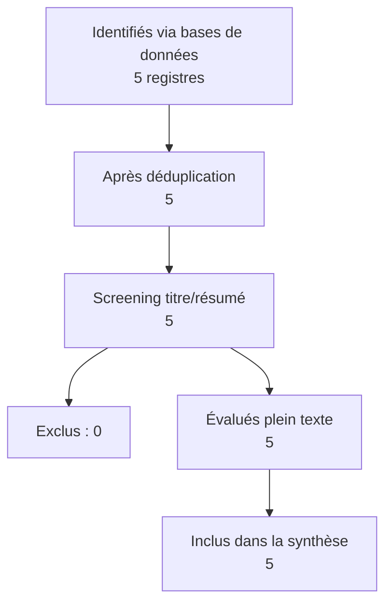

# Flux PRISMA 2020 — état

- Identifiés : **5**
- Après déduplication : **5**
- Screenés (estimation) : **5**
- Historique : 179 mise(s) à jour

## Diagramme

```mermaid
flowchart TD
    A[Identifiés via bases de données<br/>5 registres] --> B[Après déduplication<br/>5]
    B --> C[Screening titre/résumé<br/>5]
    C --> D[Exclus : 0]
    C --> E[Évalués plein texte<br/>5]
    E --> F[Inclus dans la synthèse<br/>5]
```